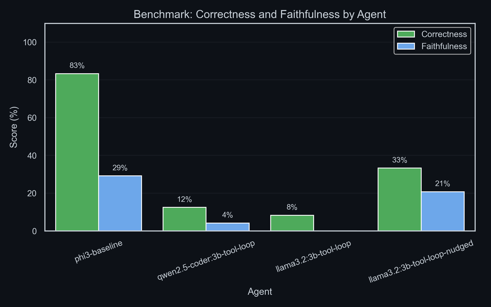
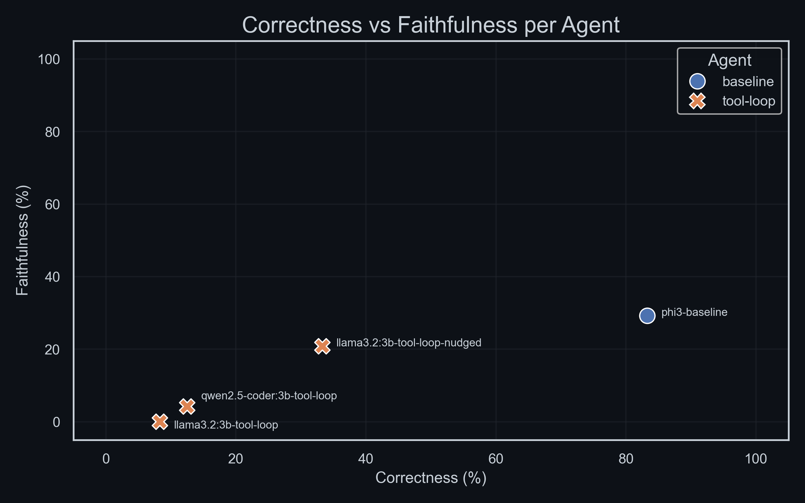
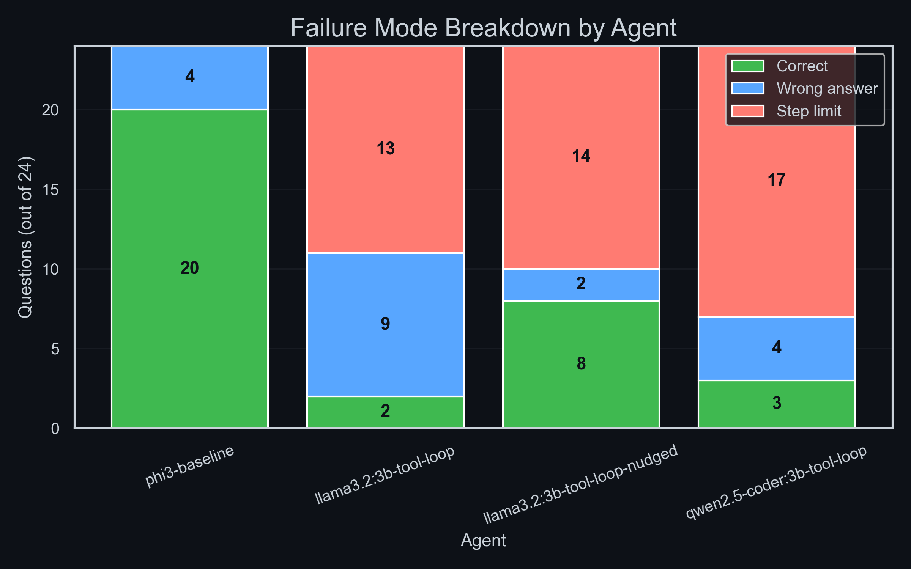

# M2 Benchmark Report: Agentic Tool Loop vs Baseline Pipeline

**Date:** 2026-06-25 · **Run ID:** 20260625-1903 · **Questions:** 24 · **Judge:** LLM-as-judge (correctness + faithfulness)

---

## Summary

| Agent | Model | Correctness | Faithfulness |
|---|---|---|---|
| `phi3-baseline` | phi3 | **83.3%** | 29.2% |
| `llama3.2:3b-tool-loop-nudged` | llama3.2:3b | 33.3% | 20.8% |
| `qwen2.5-coder:3b-tool-loop` | qwen2.5-coder:3b | 12.5% | 4.2% |
| `llama3.2:3b-tool-loop` | llama3.2:3b | 8.3% | 0.0% |

The baseline pipeline decisively outperforms all tool-calling agents on correctness (83.3% vs 8–33%).

---

## Score by Agent

---

## Correctness vs Faithfulness

The baseline pipeline is the best-performing run, though its faithfulness is still low at 29.2%. All tool-loop agents cluster near the origin, scoring poorly on both axes.

---

## Failure Mode Breakdown

| Agent | Correct | Wrong answer | Step limit exhausted |
|---|---|---|---|
| `phi3-baseline` | 20 | 0 | 0 (4 "no retrieval") |
| `llama3.2:3b-tool-loop` | 2 | 9 | **13 (54%)** |
| `llama3.2:3b-tool-loop-nudged` | 8 | 2 | **14 (58%)** |
| `qwen2.5-coder:3b-tool-loop` | 3 | 4 | **17 (71%)** |

---

## Why the Tool-Calling Agents Fail

### Root cause: models don't know when to stop

The dominant failure mode is **step limit exhaustion**: the agent keeps issuing tool calls and never produces a final answer. This accounts for 54–71% of all tool-loop responses. The model treats every turn as a retrieval opportunity instead of recognising when it has gathered enough context to synthesise a reply.

This is a known weakness of small (3B parameter) instruction-tuned models. They learn the pattern of calling tools but are not trained on the equally important skill of deciding when to stop. The result is an infinite loop that hits the hard step cap.

### Nudges partially help

Adding "stop and answer now" nudges to the llama3.2:3b system prompt improves correctness from 8.3% → 33.3% (4× gain). However, 58% of questions still hit the step limit, suggesting the nudge text is processed inconsistently. The model responds to the nudge on some turns but ignores it on others.

### Faithfulness is low even when an answer is given

Even the baseline scores only 29.2% on faithfulness. The LLM judge flags that models routinely cite context snippets that are tangentially relevant, not the direct source, or make additional claims unsupported by the retrieved context. This is likely a prompt engineering issue: context is presented as a flat dump and the model over-reads it.

---

## Conclusions

1. **The tool-calling loop does not yet outperform the one-shot baseline** at 3B scale. The gap is large: 83.3% vs 33.3% for the best tool-calling run.

2. **Step limit exhaustion is the primary bottleneck**, not retrieval quality. The agents fail to produce an answer, not to retrieve the right evidence.

3. **Nudges are a viable short-term mitigation** but are not a fix: they depend on the model obeying an instruction it is not reliably instruction-tuned to follow.

4. **Faithfulness is universally low**, pointing to a prompt-level issue with how retrieved context is presented to the judge.

---

## Things to Try

- **Larger or agentic-trained models**: A 7B+ model or one specifically trained for ReAct-style loops (e.g. Qwen2.5-Coder:7b, Llama 3.1:8b) may handle loop termination better.
- **Structured final-answer format**: Forcing the loop to conclude with a schema that distinguishes "tool call" from "final answer" would prevent models from continuing to call tools after they have enough context.
- **Improve faithfulness prompt**: Asking the model to quote the exact snippet supporting its answer, rather than paraphrasing the context, could improve faithfulness scores.
- **Extend the gold set**: 24 questions gives a directional signal but is too small for reliable per-category breakdowns. Around 60–80 questions would give tighter confidence intervals.
