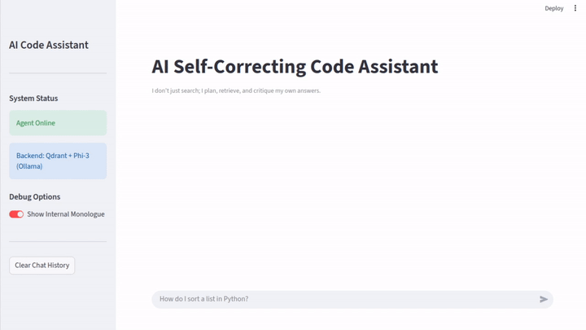
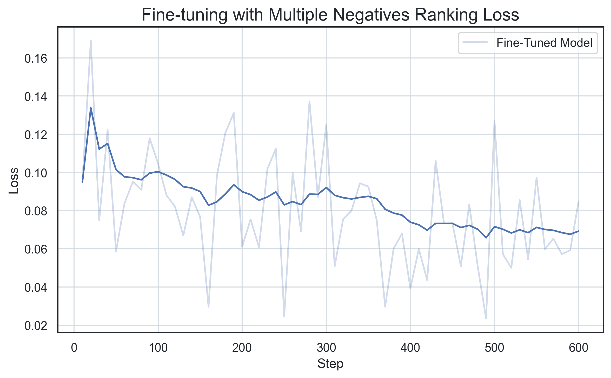
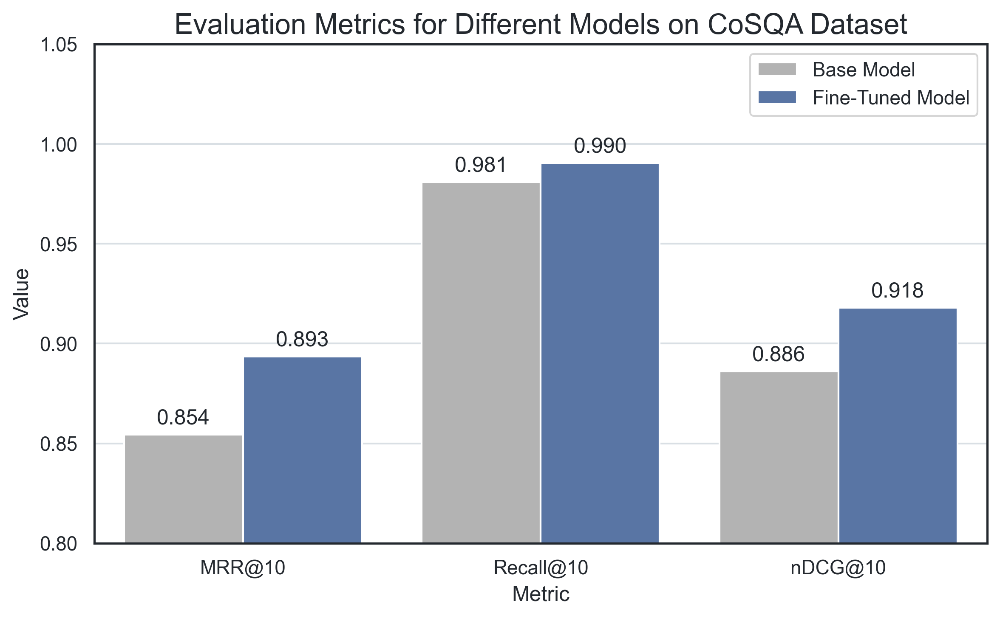
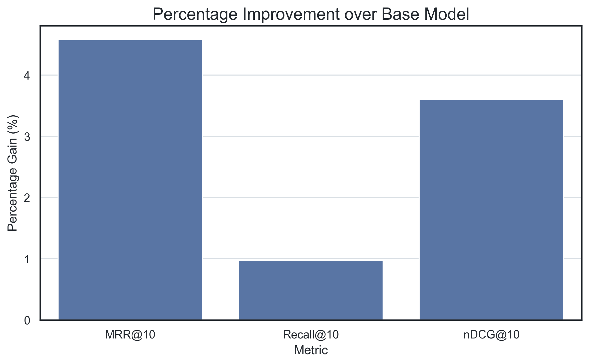
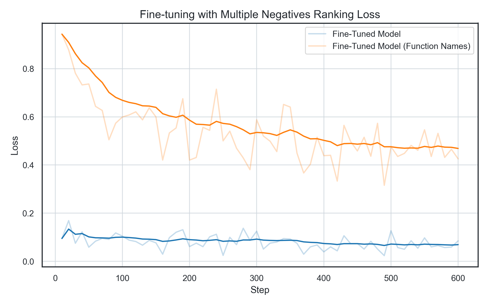
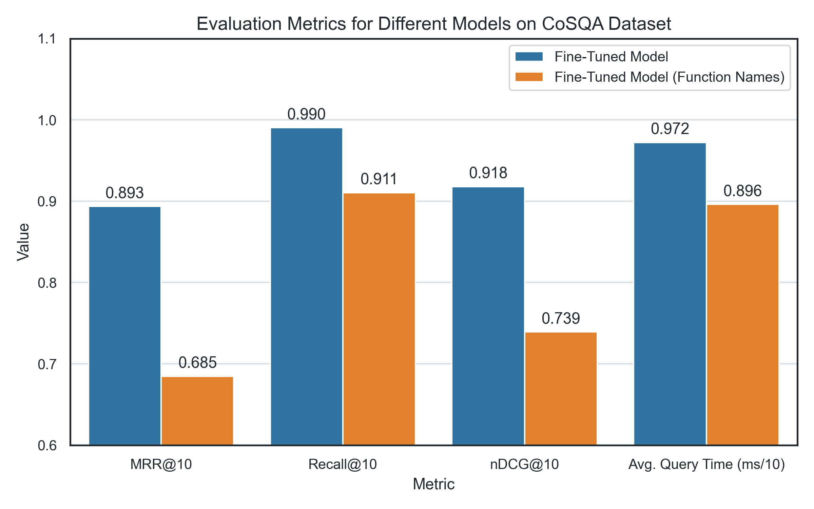

# Local AI Self-Correcting RAG Code Assistant

[](https://github.com/AndrewKM210/code-search-engine/actions/workflows/tests.yml)
[](https://www.python.org/)
[](https://qdrant.tech/)
[](https://huggingface.co/)
[](https://mlflow.org/)
[](https://ollama.com/)
[](https://www.langchain.com/)
[](https://streamlit.io/)

This project implements a Retrieval-Augmented Generation (RAG) agent designed to answer programming queries by utilizing a semantic vector database and a local Large Language Model (LLM) with a self-correction mechanism.

> **Active development:** this project is being grown from a one-shot RAG assistant into a
> full **agentic coding assistant**: an LLM that chooses tools (semantic search, read file,
> list directory, grep) to navigate a codebase, measured against the original pipeline as a
> baseline rather than assumed to be better. The work is tracked milestone by milestone in
> [ROADMAP.md](ROADMAP.md): M0 (harden the base) is done and M1 (agentic loop + tools) is in
> progress, with generation evals, an MCP server, a local/API model benchmark, and a QLoRA
> fine-tune capstone planned next.

<picture>
  <source media="(prefers-color-scheme: dark)" srcset="assets/demo_dark.gif">
  
</picture>

## Project Overview

The primary challenge in code Q&A is retrieving semantically relevant, high-quality code snippets from large, unstructured repositories. This project addresses this by:

1.  **Semantic Indexing:** Using a fine-tuned Sentence Transformer model to index the CoSQA dataset into a dense vector space (Qdrant).
2.  **Agentic Workflow:** Implementing a multi-step execution loop that generates initial search queries, evaluates the retrieval results, critiques itself, and refines the search query before synthesizing the final answer.
3.  **Local LLM Integration:** Utilizing **Ollama (Phi-3)** to ensure low-latency reasoning and data privacy without reliance on external commercial APIs.

### Technical Stack

| Category | Component | Purpose |
| :--- | :--- | :--- |
| **Orchestration** | Python 3.10.18 | Core language |
| **Embedding Model**| SBERT / MiniLM-L6 | Generates high-dimensional semantic vectors |
| **Vector DB** | Qdrant | Vector storage and retrieval |
| **LLM Inference** | Ollama / Phi-3 | Local reasoning |
| **Agent Framework** | Custom Classes / LangChain | Manages the multi-step execution flow |
| **Frontend** | Streamlit | Interactive UI |
| **Packaging** | `pyproject.toml` / Setuptools | Dependency and project management |

### Architecture and Agentic Loop

Two agents share the same `CodeSearchEngine`/`LLMClient` and are both measured against
each other rather than one being assumed better (see [ROADMAP.md](ROADMAP.md)):

* **`CodingAgent` (baseline):** a fixed plan -> retrieve -> critique -> retry pipeline.
    1.  **Plan:** The LLM receives the user query and generates an optimized search string.
    2.  **Retrieve:** The `CodeSearchEngine` queries Qdrant to retrieve top-k code snippets.
    3.  **Critique:** The LLM checks whether the retrieved context is sufficient.
    4.  **Execute/Retry:** If sufficient, it synthesizes the final answer; if not, it
        refines the search query and repeats (up to a defined limit).
* **`ToolCallingAgent` (tool loop):** the LLM chooses which tool to call at each step
  (`search_code`, `read_file`, `list_directory`, `grep`) and can take multiple steps -
  e.g. search, then read a file, then search again - before answering.


## Getting Started

### Prerequisites
 
1.  **Ollama:** Install the Ollama model locally, advanced setup instructions can be found [here](https://docs.ollama.com/linux#manual-install).
    ```bash
    curl -fsSL https://ollama.com/install.sh | sh
    ollama pull phi3
    ```
2. **Python:** Create virtual environment with pyenv (suggested, but optional):
    ```bash
    pyenv virtualenv 3.10.18 code_search
    pyenv activate code_search
    ```

### Installation

Navigate to the project root directory and install the project in editable mode:

```bash
pip install -e .
```

For development (running tests, notebooks, plots), install the `dev` extra instead:

```bash
pip install -e ".[dev]"
```

### Initial Setup (Indexing the Data and Fine-Tuning the SBERT model)

Before running the agent, you must index the code into Qdrant.

1.  **Configure:** Check and edit configuration in `config/main_config.yaml`.
2.  **Index the CoSQA Dataset** (used for embedding fine-tuning and retrieval eval):
    ```bash
    python scripts/index_cosqa_full.py
    ```
3.  **Index this repo** (used by the agent to answer questions about its own code):
    ```bash
    python scripts/index_self_repo.py
    ```
4.  **Fine-tune the Embedding Model:**
    ```bash
    python scripts/fine_tune.py
    ```

## Usage

### Running the Agent UI

Launch the Streamlit frontend to interact with the agent:

```bash
streamlit run apps/streamlit_app.py
```

### Running the Agent CLI

```bash
python apps/cli.py --agent tool-loop --model phi3
```

* `--agent {baseline,tool-loop}` - baseline: fixed plan->search->critique pipeline.
  tool-loop: LLM chooses tools (search/read/list/grep) in a loop. Defaults to `baseline`.
* `--model MODEL` - Ollama model used for reasoning. Defaults to `phi3`.
* `--finetuned` - search using the fine-tuned embedding model instead of the base model.
* `--llm-config LLM_CONFIG` - per-model tool-calling capabilities, used by `--agent tool-loop`.

# Additional

This project also focuses on fine-tuning a pre-trained sentence transformer model (MiniLM-L6-v2) using the CoSQA (Code Search and Question Answering) dataset. The goal is to enhance the model's ability to semantically map natural language queries to relevant code snippets, outperforming the base model in retrieval metrics like MRR, nDCG and Recall. The retrieval engine is built using Qdrant for efficient vector indexing and search.

### Fine-tuning Model on CoSQA

The `fine_tune.py` script fine-tunes the sentence transformer model used in the demo on code snippets of the training split of the [CoSQA dataset](https://huggingface.co/datasets/gonglinyuan/CoSQA):

```bash
python scripts/fine_tune.py
```

Tracking is done with `mlflow` and the log of the loss during training will be stored in the `results/losses.csv` file. MLflow will automatically store all training parameters and metrics in `mlruns` and be visualized with the command:

```bash
mlflow ui
```

The loss can be plotted as shown in the `report.ipynb` notebook. An example loss plot of training for one epoch on the whole dataset is shown below. Even though the loss is noisy, the average loss does decrease over time.

<picture>
  <source media="(prefers-color-scheme: dark)" srcset="assets/loss_ft_dark.png">
  
</picture>

### CoSQA Evaluation

The `scripts/evaluate_finetuning.py` script evaluates both the base and finetuned model on the validation split of the CoSQA dataset, calculating metrics such as the MRR@10, nDCG@10 and Recall@10:

`python scripts/evaluate_finetuning.py`

The resulting metrics are stored in `results/evaluation.csv` and can be plotted for comparison as shown in the `report.ipynb` notebook. The following plot shows how the finetuned model outperforms the base model in all metrics, as well as the improvement gain in terms of percentage:

<picture>
  <source media="(prefers-color-scheme: dark)" srcset="assets/eval_ft_dark.png">
  
</picture>
<picture>
  <source media="(prefers-color-scheme: dark)" srcset="assets/improvement_ft_dark.png">
  
</picture>


### Fine-tuning on Function Names

Out of curiosity, the model was also fine-tuned using the same CoSQA dataset but only on the function names. The fine-tuning and evaluation can be done by running the following commands:

```bash
python scripts/fine_tune.py --fn_names
python scripts/evaluate_fn_names.py
```

The results will be stored in `results/losses_fn_names.csv` and `results/evaluation_fn_names.csv`, and can be plotted as shown in the `report.ipynb` notebook. The following plots show that using only function names leads to a significantly higher training loss and worse evaluation metrics. However, given that the amount of tokens stored in the database is now lower, query time is reduced.

<picture>
  <source media="(prefers-color-scheme: dark)" srcset="assets/loss_fn_dark.png">
  
</picture>
<picture>
  <source media="(prefers-color-scheme: dark)" srcset="assets/eval_fn_dark.png">
  
</picture>


